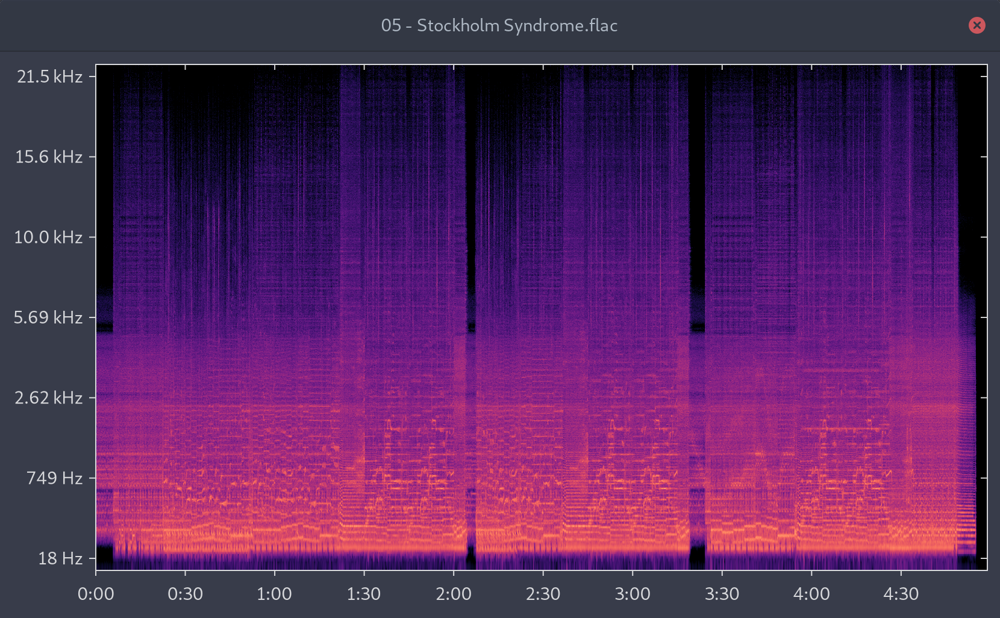

# Audiograter

A GTK-based spectrogram viewer.

Audiograter is a basic application that visualizes the frequency spectrum
of flac files. It is similar to [Spek][spek], but less fully featured and
not portable. Audiograter fully supports HiDPI.

## Usage

Drag a flac file onto the window.

## Building

    cargo build --release
    target/release/audiograter

## License

Audiograter is free software. It is licensed under the
[GNU General Public License][gplv3], version 3.

[spek]:  https://spek.cc
[gplv3]: https://www.gnu.org/licenses/gpl-3.0.html
